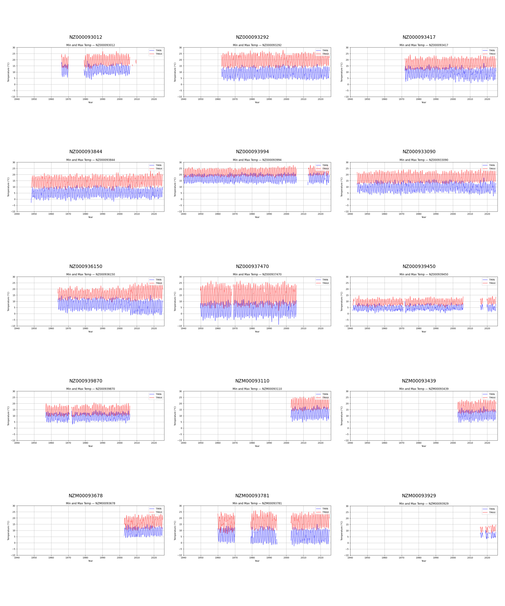
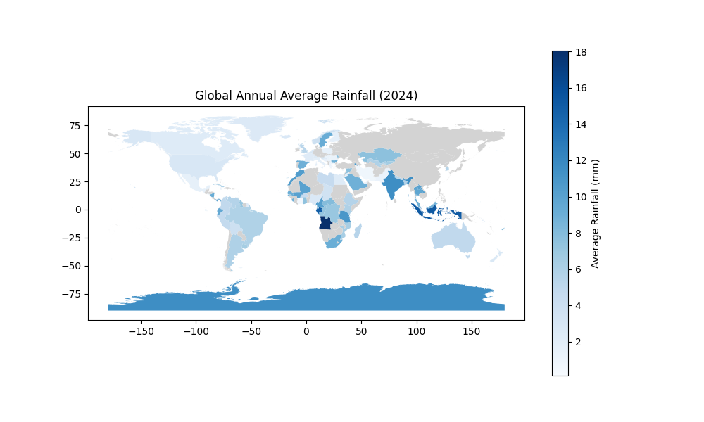

# GHCN-Daily Climate Analysis with PySpark

[](https://github.com/Kenchch/GHCN-Daily-Climate-Analysis-with-PySpark/actions/workflows/ci.yml)
[](LICENSE)

Reproducible PySpark workflows for exploring the NOAA Global Historical Climatology Network Daily (GHCN-Daily) data described in the assignment report.

The workflow is designed for the **13+ GB GHCN-Daily archive** and turns raw fixed-width station metadata plus daily observations into analysis-ready Parquet/CSV outputs without collecting the full dataset on the driver.

The project builds a station dimension from fixed-width metadata, enriches daily observations, analyses the five core weather elements (`PRCP`, `SNOW`, `SNWD`, `TMAX`, `TMIN`), and creates New Zealand temperature and country-level precipitation outputs.

## From the original coursework report (not produced here)



*Monthly TMIN/TMAX by station, 1940–2025, from the submitted analysis over the
full archive — not from the single-year `nz-temperature` command below, which
reads one year's file.*



*Country rainfall for 2024, from the submitted analysis.* **Its scale is not the
quantity this repository computes.** The map runs 0–18 mm, while
`country-precipitation` sums each station's yearly total before averaging and
so returns hundreds of millimetres for most countries . The two differ by roughly the number of days in a year,
which is consistent with the map being a per-observation mean, but the code
that drew it is not in this repository and the difference is not something the
figure states. Both images are kept as a record of the original submission;
neither was produced by the code here, and neither should be read as its
output.

## Project layout

```text
src/ghcn_pipeline.py     Command-line Spark workflow
config/example.env       Paths and output locations to customise
data/README.md           Input schema and data-access notes
assets/                  Selected visuals from the submitted analysis
tests/                   Real-Spark tests on synthetic records, no archive needed
.github/workflows/ci.yml Source compilation and real-Spark regression tests
```

## Setup

```bash
python -m venv .venv
. .venv/bin/activate                 # Windows: .venv\Scripts\activate
pip install -r requirements.txt
cp config/example.env .env
# Edit .env to point to your downloaded files, then load it in Bash:
set -a
source .env
set +a
```

Set the paths in `.env` (or pass the equivalent command-line options). The Python CLI does not load `.env` automatically. The commands below use Bash variable syntax; on PowerShell, pass literal paths or use `$env:GHCN_STATIONS` and the equivalent environment variables. Spark also requires a compatible Java runtime. The source data is not included: the GHCN-Daily archive is large and has its own distribution terms.

## Run

```bash
# Build an enriched station table as Parquet
spark-submit src/ghcn_pipeline.py enrich-stations \
  --stations "$GHCN_STATIONS" --countries "$GHCN_COUNTRIES" \
  --states "$GHCN_STATES" --inventory "$GHCN_INVENTORY" \
  --output "$OUTPUT_DIR/enriched_stations"

# Produce New Zealand monthly temperature tables from daily observations
spark-submit src/ghcn_pipeline.py nz-temperature \
  --daily "$GHCN_DAILY_2024" --stations "$OUTPUT_DIR/enriched_stations" \
  --output "$OUTPUT_DIR/nz_temperature"

# Aggregate annual country precipitation and write a CSV for mapping
spark-submit src/ghcn_pipeline.py country-precipitation \
  --daily "$GHCN_DAILY_GLOB" --stations "$OUTPUT_DIR/enriched_stations" \
  --output "$OUTPUT_DIR/country_precipitation"
```

`daily` accepts a CSV/CSV.GZ glob. Values are stored in GHCN's tenths of a unit; the script converts `TMIN`/`TMAX` to degrees C and `PRCP` to millimetres in derived outputs.

## Reproducibility notes

CI runs small synthetic fixtures through the actual Spark reader and output
writers, checking quality-flag exclusion, temperature and precipitation unit
conversion, NZ filtering, and station-level precipitation aggregation. It also
covers the metadata side: that each fixed-width field is read from its published
offset and that blank optional columns come back empty rather than shifted, that
the three enrichment joins keep the station as the primary grain, and that the
Haversine expression matches a distance derivable by hand. Run
`python -m pip install pytest` and `python -m pytest -q` with Java and the project
dependencies installed to repeat it. This checks transformation behaviour; it
does not reproduce the historical charts or validate performance at 13+ GB.

The precipitation output is the unweighted mean of each station's **observed**
yearly total. Incomplete station-years are not adjusted or excluded by a
coverage threshold, and station locations are not area-weighted. Likewise, the
temperature output averages available station means. These are descriptive
station-network summaries, not coverage-adjusted national climate estimates.

- Metadata files are parsed by their published fixed-width positions rather than inferred as CSV.
- The station enrichment uses left joins so station records remain the primary grain.
- Distance calculations use a Spark SQL Haversine expression, avoiding Python-UDF serialisation overhead.
- The project intentionally does not ship the original 13+ GB data archive or cloud credentials.
- Original notebooks and report are not included; `src/ghcn_pipeline.py` is a rewrite.

The original PDF was used as the source for the selected visuals, but is not included in the repository.
