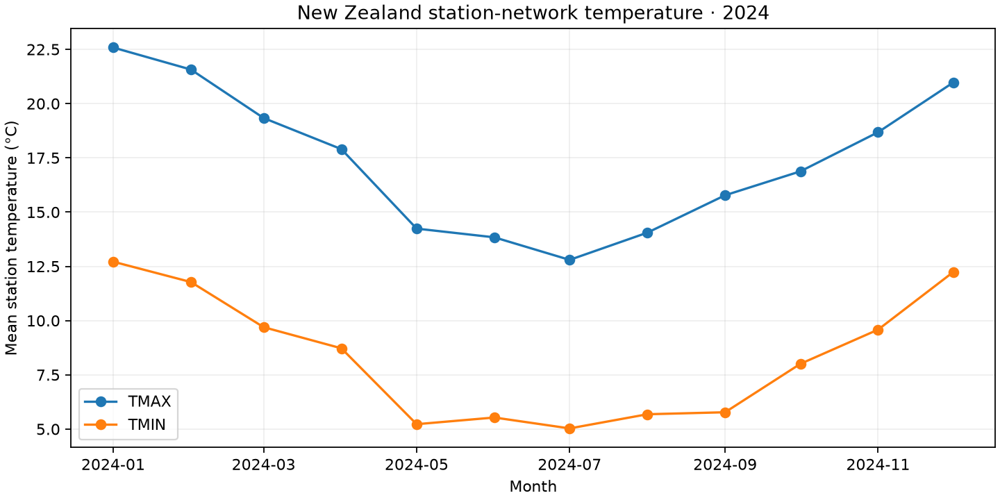
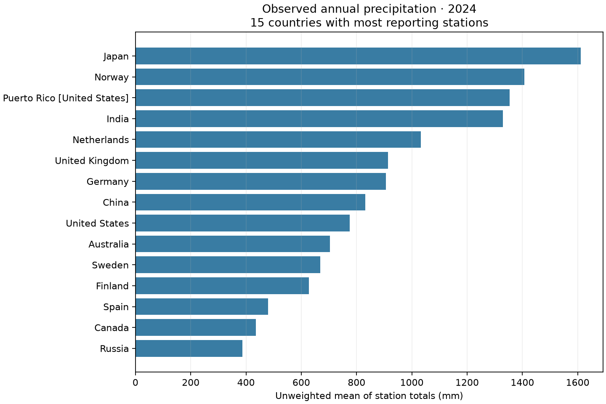

# GHCN-Daily Climate Analysis with PySpark

[](https://github.com/Kenchch/GHCN-Daily-Climate-Analysis-with-PySpark/actions/workflows/ci.yml)
[](LICENSE)

PySpark workflows for the NOAA GHCN-Daily archive, validated on the complete
2024 year file (37,106,497 observations). The full historical archive was not
processed here. Fixed-width metadata becomes an enriched station dimension;
weather observations become monthly temperature and annual precipitation tables.

## Verified outputs





Both figures are generated by `scripts/plot.py` from the committed result CSVs.
[Run configuration, counts, timings and limits](docs/results.md) ·
[Machine-readable evidence](results/run-metrics.json).

## Project layout

```text
src/ghcn_pipeline.py     Command-line Spark workflow
config/example.env       Paths and output locations to customise
data/README.md           Input schema and data-access notes
assets/                  Generated result figures and historical coursework visuals
results/                 Small verified 2024 outputs and source hashes
scripts/                 Download, full-year run and plotting commands
tests/                   Real-Spark tests on synthetic records, no archive needed
.github/workflows/ci.yml Source compilation and real-Spark regression tests
```

## Setup

```bash
python -m venv .venv
. .venv/bin/activate                 # Windows: .venv\Scripts\activate
pip install -r requirements.txt
cp config/example.env .env
# Edit .env to point to your downloaded files, then load it in Bash:
set -a
source .env
set +a
```

Set the paths in `.env` (or pass the equivalent command-line options). The Python CLI does not load `.env` automatically. The commands below use Bash variable syntax; on PowerShell, pass literal paths or use `$env:GHCN_STATIONS` and the equivalent environment variables. Java 17.0.20 was used for the recorded run. The source data is not included: the GHCN-Daily archive is large and has its own distribution terms.

## Run

```bash
# Build an enriched station table as Parquet
spark-submit src/ghcn_pipeline.py enrich-stations \
  --stations "$GHCN_STATIONS" --countries "$GHCN_COUNTRIES" \
  --states "$GHCN_STATES" --inventory "$GHCN_INVENTORY" \
  --output "$OUTPUT_DIR/enriched_stations"

# Produce New Zealand monthly temperature tables from daily observations
spark-submit src/ghcn_pipeline.py nz-temperature \
  --daily "$GHCN_DAILY_2024" --stations "$OUTPUT_DIR/enriched_stations" \
  --output "$OUTPUT_DIR/nz_temperature"

# Aggregate annual country precipitation and write a CSV for mapping
spark-submit src/ghcn_pipeline.py country-precipitation \
  --daily "$GHCN_DAILY_GLOB" --stations "$OUTPUT_DIR/enriched_stations" \
  --output "$OUTPUT_DIR/country_precipitation"
```

`daily` accepts a CSV/CSV.GZ glob. Values are stored in GHCN's tenths of a unit; the script converts `TMIN`/`TMAX` to degrees C and `PRCP` to millimetres in derived outputs.

## Reproducibility notes

CI runs small synthetic fixtures through the actual Spark reader and output
writers, checking quality-flag exclusion, temperature and precipitation unit
conversion, NZ filtering, and station-level precipitation aggregation. It also
covers the metadata side: that each fixed-width field is read from its published
offset and that blank optional columns come back empty rather than shifted, that
the three enrichment joins keep the station as the primary grain, and that the
Haversine expression matches a distance derivable by hand. Run
`python -m pip install pytest` and `python -m pytest -q` with Java and the project
dependencies installed to repeat it. This checks transformation behaviour; it
does not reproduce the historical charts or validate full-archive performance.

The precipitation output is the unweighted mean of each station's **observed**
yearly total. Incomplete station-years are not adjusted or excluded by a
coverage threshold, and station locations are not area-weighted. Likewise, the
temperature output averages available station means. These are descriptive
station-network summaries, not coverage-adjusted national climate estimates.

- Metadata files are parsed by their published fixed-width positions rather than inferred as CSV.
- The station enrichment uses left joins so station records remain the primary grain.
- Distance calculations use a Spark SQL Haversine expression, avoiding Python-UDF serialisation overhead.
- The project intentionally does not ship the original 13+ GB data archive or cloud credentials.
- Original notebooks and report are not included; `src/ghcn_pipeline.py` is a rewrite.

## Origin

This repository reimplements a University of Canterbury DATA420 coursework
analysis. The original notebook is unavailable; `src/ghcn_pipeline.py` is a
rewrite. The current README figures come from the recorded 2024 run; the old
screenshots remain in assets as historical material.

## Data and licence

Code is MIT. Inputs come from NOAA's public
[GHCN-Daily distribution](https://www.ncei.noaa.gov/pub/data/ghcn/daily/).
Raw year files are downloaded locally; this repository includes only small
aggregate results and three metadata records for reader regression tests.
Dataset reference: Menne et al. (2012), *An overview of the Global Historical
Climatology Network-Daily Database*, [doi:10.1175/JTECH-D-11-00103.1](https://doi.org/10.1175/JTECH-D-11-00103.1).

Find nearby stations with `nearest-stations --stations <enriched_parquet>
--latitude -43.53 --longitude 172.64 --limit 10 --output <new_directory>`, passed
to the same `spark-submit src/ghcn_pipeline.py` entry point.

## How this was built

I set the problem, the data contracts and the quality rules, ran the benchmarks
and reviewed every diff; Claude Code and OpenAI Codex drafted code, refactored
and scaffolded tests. The full note — including the `Co-Authored-By` trailers
removed from this repository's history on 6 September 2026 — is on my profile:
[How I use AI tools](https://github.com/Kenchch/Kenchch#how-i-use-ai-tools).
